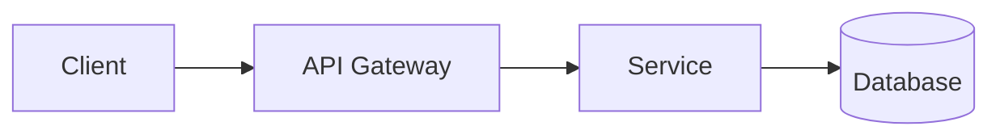

# Diagram Strategy (Mermaid)

## Principles
- Keep diagrams as Mermaid source in markdown for diffability.
- Add one intent sentence before each diagram.
- Prefer multiple focused diagrams over one overloaded diagram.

## Recommended Diagram Types
- Context (`flowchart`)
- Sequence (`sequenceDiagram`)
- Deployment (`flowchart` with infrastructure nodes)
- Failure path (`stateDiagram-v2`)

## Example

